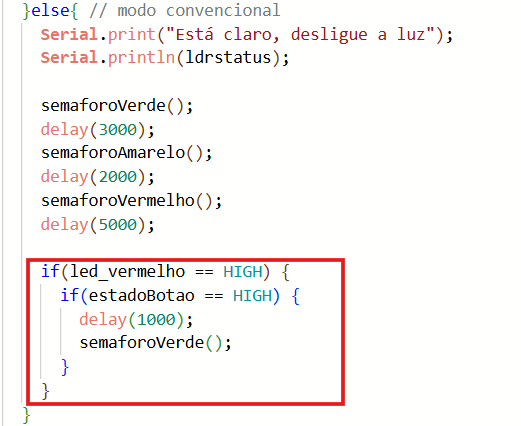
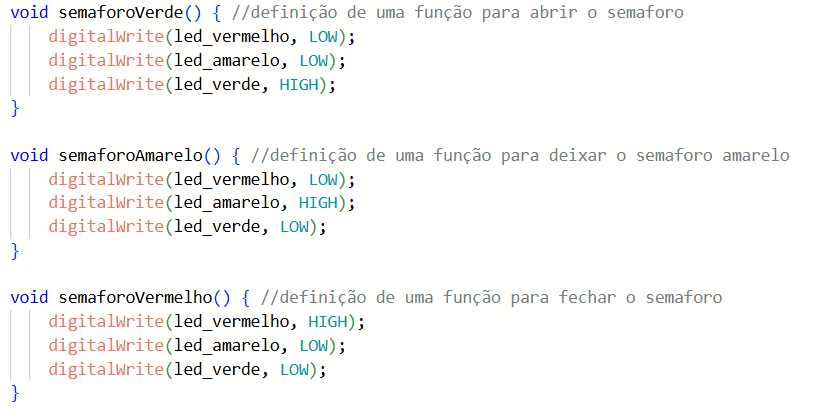
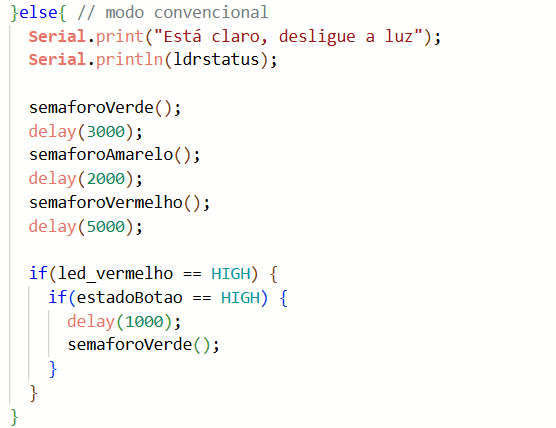
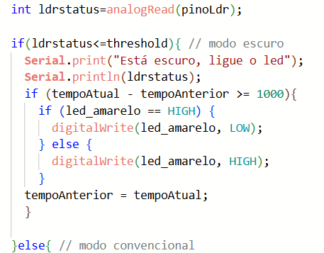
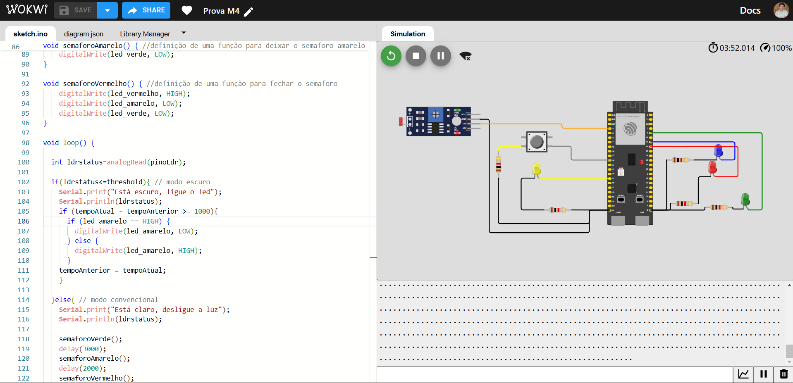

# Sistema no Modo Convencional
- Alternância dos Leds como um semaforo (verde -> amarelo -> vermelho)

- Se o Led vermelho estiver acionado e o botão for pressionado, o semaforo fica verde um segundo depois

Para o acionamento de cada estado do semaforo (aberto, amarelo, fechado), foram definidas as seguintes funções:

A implementação dessas funções foi feita da seguinte maneira:

# Sistema no Modo Noturno
- Led amarelo pisca de 1 em 1 segundo => tempo verificado com a função millis

Para identificar que o ambiente está escuro, verificamos de <code>ldrstatus<=threshold</code>

A implementação do modo noturna ocorreu da sgeuinte maneira:

**O wokwi não conectou o wifi, como observado na imagem abaixo, então não foi possível verificar o funcionamento dos estados.**

